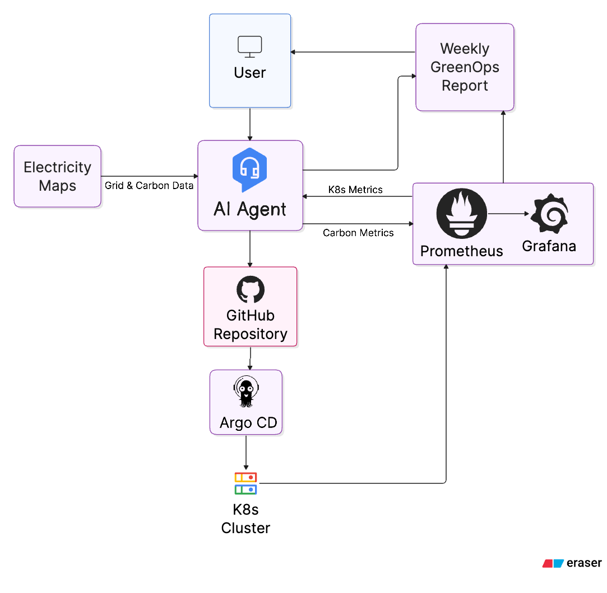
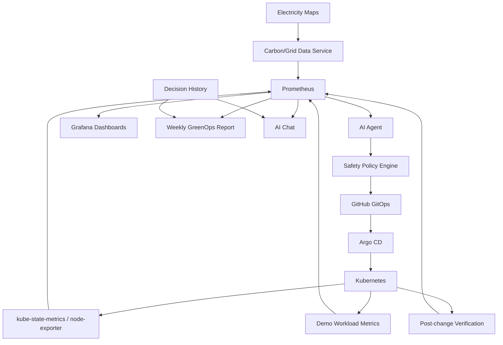
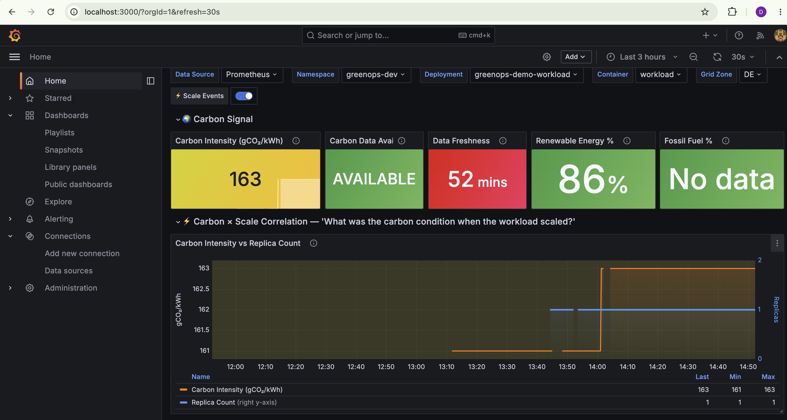
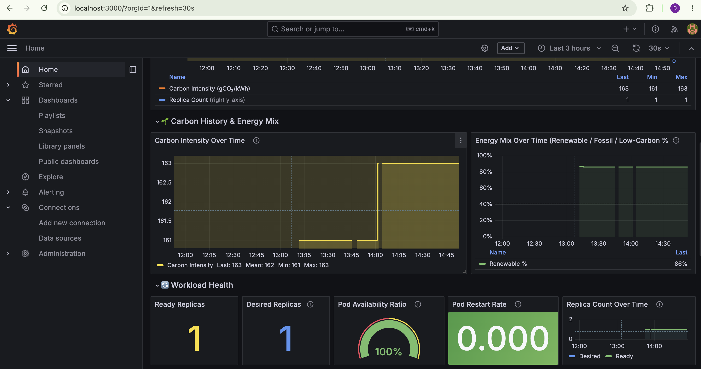
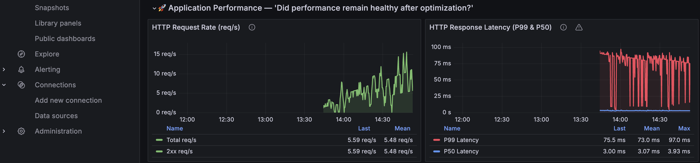
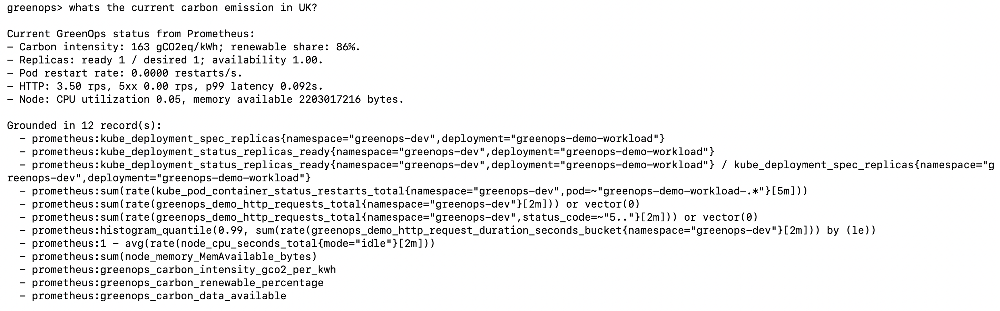
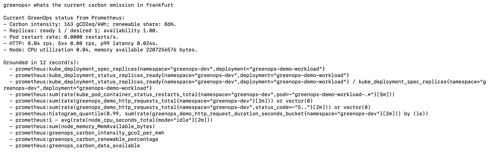

# GreenOps AI — Autonomous Carbon-Aware Cloud Optimizer

## Overview

GreenOps AI combines real-time electricity-grid carbon intelligence with Kubernetes workload telemetry to make safe, explainable infrastructure optimization decisions. It observes live carbon intensity from Electricity Maps, workload health and replica state from Prometheus, and then routes any infrastructure change through deterministic safety validation and a review-first GitOps workflow.

Reliability is the first constraint. Carbon-aware recommendations are only useful when the application remains healthy, observable, and reversible.

## Problem Statement

Cloud workloads are often over-provisioned for peak traffic even when demand is low. That idle capacity increases infrastructure cost and can raise the environmental impact of running applications, especially during periods when the local electricity grid is carbon intensive.

GreenOps AI explores a practical operating model for carbon-aware infrastructure: use real telemetry, respect application safety limits, and change desired state through auditable GitOps rather than direct cluster mutation.

## Solution

The project connects these implemented pieces:

- Electricity Maps integration for live grid and carbon signals.
- A carbon metrics exporter that exposes `greenops_carbon_*` metrics to Prometheus.
- A FastAPI demo workload with Prometheus application metrics.
- Kubernetes manifests for dev/prod workloads and local kind-based telemetry.
- kube-state-metrics and node-exporter for workload and node signals.
- Prometheus queries shared by the agent, chat interface, dashboards, and tests.
- Grafana dashboards for carbon, workload health, request rate, and latency.
- An AI recommendation layer plus deterministic safety policy validation.
- Review-first GitHub GitOps changes reconciled by Argo CD.
- Post-change verification, decision history, weekly reporting, and grounded chat.

## Architecture





## How It Works

GreenOps AI follows a closed feedback loop:

```text
Observe -> Analyze -> Decide -> Validate -> GitOps Change -> Deploy -> Measure -> Re-evaluate -> Report
```

For example, if the workload has 8 replicas, traffic and CPU utilization are low, the application is healthy, and carbon intensity is high, the agent may recommend reducing replicas from 8 to 4. The deterministic safety policy then checks guardrails such as minimum replicas, workload health, CPU thresholds, latency thresholds, restart signals, stale carbon data, cooldown, and maximum scale-down percentage before any GitOps change is prepared.

Reducing replicas does not directly power off physical servers. The expected chain is:

```text
fewer required workloads -> better workload consolidation -> potentially fewer worker nodes through autoscaling -> potentially lower compute demand -> lower infrastructure cost and estimated environmental impact
```

## Key Features

- Real-time Electricity Maps carbon intensity and energy mix ingestion.
- Prometheus carbon exporter with credential redaction.
- Docker Compose local stack for workload, carbon exporter, Prometheus, and Grafana.
- kind-friendly Kubernetes demo workload manifests.
- kube-state-metrics and node-exporter manifests for local Kubernetes telemetry.
- Grafana dashboards for carbon signal, energy mix, workload replicas, availability, restarts, request rate, and latency.
- AI recommendation service with deterministic safety guardrails.
- GitHub GitOps workflow that prepares branch/commit/PR changes instead of mutating Kubernetes directly.
- Argo CD applications for dev and prod overlays.
- Post-change verification and append-only decision history.
- Weekly report generation from recorded decision history.
- Grounded chat CLI that answers from Prometheus and stored GreenOps decisions.

## Technology Stack

- Python 3.11+
- FastAPI and Uvicorn
- Pydantic and pydantic-settings
- Docker and Docker Compose
- Kubernetes, kubectl, Kustomize, and kind
- Prometheus, kube-state-metrics, and node-exporter
- Grafana
- Argo CD
- GitHub / GitOps
- Electricity Maps API
- pytest, ruff, mypy, respx, and PyYAML

## Project Structure

```text
agent/        AI recommendation loop, safety policy, verification, controller
app/          FastAPI demo workload and application metrics
argocd/       Argo CD project, applications, and repository secret template
carbon/       Electricity Maps client, carbon models, exporter, metrics server
chat/         Retrieval-grounded operational chat interface
config/       Environment settings and structured logging
docker/       Runtime Dockerfiles for workload and carbon exporter
docs/         End-to-end production integration notes
gitops/       Review-first GitHub GitOps branch, commit, and PR workflow
k8s/          Kubernetes base, dev/prod overlays, and monitoring manifests
monitoring/   Prometheus config, queries, rules, Grafana dashboards
reports/      Weekly report generation from decision history
scripts/      Local helper scripts, including interactive chat
tests/        Unit and integration tests
Images/       Project screenshots and architecture image assets
```

## Prerequisites

- Git
- Python 3.11 or newer
- Docker and Docker Compose
- kubectl
- kind, for the local Kubernetes demo
- An Electricity Maps API key
- Optional: Argo CD CLI for manual sync/status commands

## Environment Configuration

Create a local environment file from the tracked template:

```bash
cp .env.example .env
```

Set real secrets only in `.env`:

```dotenv
ELECTRICITY_MAPS_API_KEY=<your-key>
GRAFANA_ADMIN_PASSWORD=<your-local-password>
```

Never commit `.env` or any file containing real secrets. The repository tracks `.env.example` only, with empty secret fields.

## Running the Project

Install development dependencies:

```bash
make install-dev
```

Start the Docker Compose services:

```bash
docker compose up -d --build
```

For the local kind workload and Kubernetes metrics bridge:

```bash
kind create cluster --name greenops
kubectl apply -k k8s/overlays/dev
kubectl apply -k k8s/monitoring
kubectl -n greenops-dev rollout status deployment/greenops-demo-workload
kubectl -n greenops-monitoring rollout status deployment/kube-state-metrics
kubectl -n greenops-monitoring rollout status daemonset/node-exporter
kubectl -n greenops-monitoring port-forward svc/kube-state-metrics 18080:8080
kubectl -n greenops-monitoring port-forward svc/node-exporter 19100:9100
kubectl -n greenops-dev port-forward svc/greenops-demo-workload 18000:80
```

Prometheus in Docker Compose scrapes those forwarded kind endpoints through `host.docker.internal`.

Restart only Prometheus after changing scrape configuration:

```bash
docker compose restart prometheus
```

## Accessing Services

- Grafana: http://localhost:3000
- Prometheus: http://localhost:9090
- Demo workload through Docker Compose: http://localhost:8000
- Carbon exporter metrics: http://localhost:8002/metrics
- kind demo workload, when port-forwarded: http://localhost:18000
- kube-state-metrics, when port-forwarded: http://localhost:18080/metrics
- node-exporter, when port-forwarded: http://localhost:19100/metrics
- Argo CD UI, when port-forwarded: https://localhost:8080

The interactive chat helper runs in the terminal:

```bash
make chat-agent
make chat-agent ARGS="whats the current status?"
```

## Useful Validation Commands

```bash
docker compose config
docker compose ps
kubectl get pods -A
kubectl get deployments -A
kubectl -n greenops-dev get svc greenops-demo-workload
kubectl -n greenops-monitoring get svc kube-state-metrics node-exporter
make health
```

Prometheus API examples:

```bash
curl -G "http://localhost:9090/api/v1/query" --data-urlencode 'query=greenops_carbon_intensity_gco2_per_kwh'
curl -G "http://localhost:9090/api/v1/query" --data-urlencode 'query=kube_deployment_status_replicas_ready{namespace="greenops-dev",deployment="greenops-demo-workload"}'
```

## Prometheus Metrics

Implemented GreenOps carbon metrics include:

- `greenops_carbon_intensity_gco2_per_kwh`
- `greenops_carbon_renewable_percentage`
- `greenops_carbon_data_available`
- `greenops_carbon_data_age_seconds`

Application and workload signals include:

- `greenops_demo_http_requests_total`
- `greenops_demo_http_request_duration_seconds`
- `greenops_demo_work_requests_total`
- `kube_deployment_status_replicas_ready`
- `kube_deployment_spec_replicas`
- `kube_pod_status_ready`
- `kube_pod_container_status_restarts_total`
- `node_cpu_seconds_total`
- `node_memory_MemAvailable_bytes`

The agent also defines PromQL for cAdvisor `container_*` CPU and memory usage metrics. In the current local kind bridge, kube-state-metrics and node-exporter are exposed; cAdvisor scraping is not yet wired into the Compose Prometheus configuration.

## Grafana

The provisioned GreenOps dashboards show:

- Current carbon intensity and renewable percentage.
- Carbon history and energy mix.
- Ready and desired replicas for the Kubernetes workload.
- Pod availability and restart signals.
- Application request rate.
- P50 and P99 latency.
- Replica count over time and carbon/replica correlation.

## Results











## Safety Model

AI recommendations do not bypass deterministic policy validation. The policy engine rejects or requires review when required signals are missing, carbon data is unavailable or stale, replica targets violate configured bounds, CPU utilization is above the scale-down threshold, P99 latency is at or above the SLA threshold, all replicas are not ready, HTTP errors are present, pod restarts are present, cooldown has not elapsed, or the requested scale-down exceeds the configured percentage.

The default safeguards are configured through environment variables such as `AGENT_MIN_REPLICAS`, `AGENT_MAX_REPLICAS`, `AGENT_CPU_SAFETY_THRESHOLD`, `AGENT_LATENCY_SLA_THRESHOLD_SECONDS`, `AGENT_MAX_SCALE_DOWN_PERCENTAGE`, and `AGENT_OPTIMIZATION_COOLDOWN_SECONDS`.

## GitOps Workflow

The GreenOps agent does not directly mutate Kubernetes resources. Approved recommendations flow through:

```text
AI Recommendation -> Policy Validation -> GitHub Desired State -> Argo CD -> Kubernetes
```

The GitOps workflow updates only the configured Kubernetes manifest path, prepares an auditable commit, and can create a GitHub pull request when `GREENOPS_GITOPS_CREATE_PULL_REQUEST=true` and the required repository/token settings are provided. Workload Argo CD applications are configured for human-triggered sync.

## Reporting and AI Chat

Generate a weekly report:

```bash
make report
```

The report is built from decision history and includes recorded decisions, carbon and reliability context, policy rejections, verification results, and estimated impact where the underlying data exists.

Ask grounded operational questions:

```bash
make chat-agent
```

Useful questions include:

- "What is the current carbon intensity?"
- "What decisions did you make this week?"
- "Why did the last scale-down happen?"
- "Did latency change after the last optimization?"
- "Were any recommendations rejected by policy?"

Historical answers are grounded in `REPORT_DECISION_HISTORY_PATH`. If no decision history has been recorded, the chat interface says so instead of inventing an answer.

## Testing

Run the standard checks:

```bash
make lint
make type-check
make test
```

Additional validation:

```bash
docker compose config
docker compose build
kubectl kustomize k8s/overlays/dev
kubectl kustomize k8s/overlays/prod
kubectl kustomize k8s/monitoring
```

## Security

- Real `.env` files are ignored by Git.
- `.env.example` contains empty secret fields only.
- Docker Compose fails fast when `ELECTRICITY_MAPS_API_KEY` or `GRAFANA_ADMIN_PASSWORD` is not configured.
- API keys and GitHub tokens are represented with `SecretStr` and redacted from errors/logs.
- Kubernetes manifests do not contain real credentials.
- The Argo CD repository secret file is a template and must be populated through a secure local or cluster secret workflow.
- The agent has no Kubernetes client dependency and no kubeconfig setting.
- Infrastructure changes are gated by deterministic safety policy and GitOps review.

## Current Limitations

- The default setup is a local development architecture using Docker Compose plus kind.
- kind Kubernetes metrics are reached from Compose Prometheus through local port-forwards, so those port-forwards must stay running during local validation.
- Estimated carbon and cost impact depend on available metrics; the project does not claim measured carbon reductions.
- cAdvisor `container_*` CPU and memory usage scraping is defined in agent queries but not yet exposed through the current Compose-to-kind metrics bridge.
- GitHub pull request creation requires an explicitly configured local token and repository.

## Future Improvements

- Managed Kubernetes deployment profile.
- Multi-region carbon-aware placement recommendations.
- Cloud billing and node autoscaler integration.
- Richer energy and emissions estimation model.
- Production approval workflow around GitOps changes.
